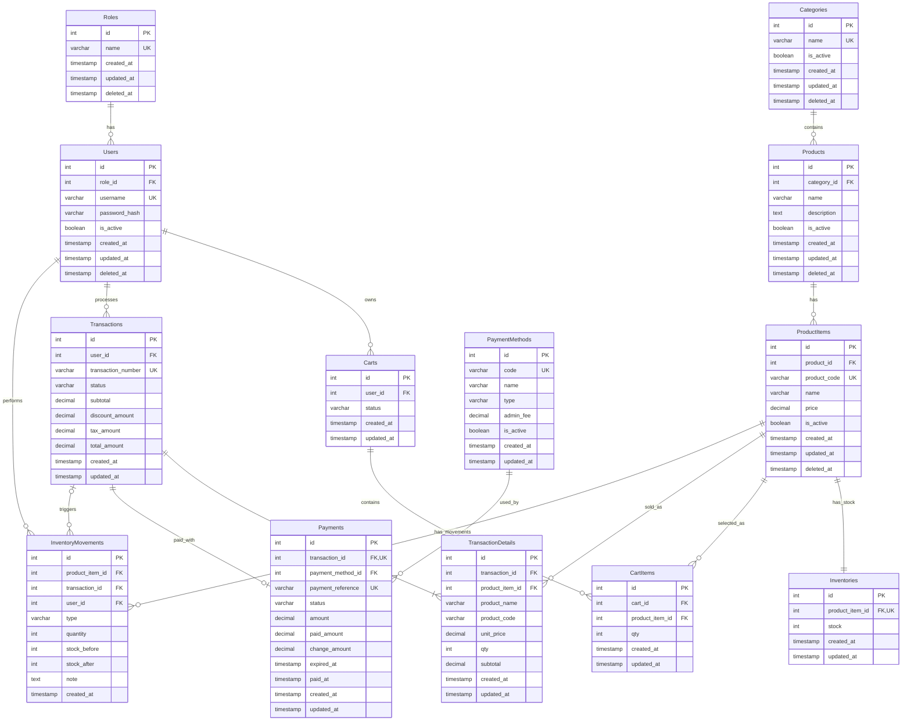

# NashTa Group Sandbox

## ERD 

```mermaid
erDiagram
    Roles ||--o{ Users : has
    Categories ||--o{ Products : contains
    Products ||--o{ ProductItems : has
    ProductItems ||--|| Inventories : has_stock

    Users ||--o{ Carts : owns
    Carts ||--o{ CartItems : contains
    ProductItems ||--o{ CartItems : selected_as

    Users ||--o{ Transactions : processes
    Transactions ||--|{ TransactionDetails : contains
    ProductItems ||--o{ TransactionDetails : sold_as

    Transactions ||--o| Payments : paid_with
    PaymentMethods ||--o{ Payments : used_by

    ProductItems ||--o{ InventoryMovements : has_movements
    Transactions o|--o{ InventoryMovements : triggers
    Users ||--o{ InventoryMovements : performs

    Roles {
        int id PK
        varchar name UK
        timestamp created_at
        timestamp updated_at
        timestamp deleted_at
    }

    Users {
        int id PK
        int role_id FK
        varchar username UK
        varchar password_hash
        boolean is_active
        timestamp created_at
        timestamp updated_at
        timestamp deleted_at
    }

    Categories {
        int id PK
        varchar name UK
        boolean is_active
        timestamp created_at
        timestamp updated_at
        timestamp deleted_at
    }

    Products {
        int id PK
        int category_id FK
        varchar name
        text description
        boolean is_active
        timestamp created_at
        timestamp updated_at
        timestamp deleted_at
    }

    ProductItems {
        int id PK
        int product_id FK
        varchar product_code UK
        varchar name
        decimal price
        boolean is_active
        timestamp created_at
        timestamp updated_at
        timestamp deleted_at
    }

    Inventories {
        int id PK
        int product_item_id FK,UK
        int stock
        timestamp created_at
        timestamp updated_at
    }

    Carts {
        int id PK
        int user_id FK
        varchar status
        timestamp created_at
        timestamp updated_at
    }

    CartItems {
        int id PK
        int cart_id FK
        int product_item_id FK
        int qty
        timestamp created_at
        timestamp updated_at
    }

    Transactions {
        int id PK
        int user_id FK
        varchar transaction_number UK
        varchar status
        decimal subtotal
        decimal discount_amount
        decimal tax_amount
        decimal total_amount
        timestamp created_at
        timestamp updated_at
    }

    TransactionDetails {
        int id PK
        int transaction_id FK
        int product_item_id FK
        varchar product_name
        varchar product_code
        decimal unit_price
        int qty
        decimal subtotal
        timestamp created_at
        timestamp updated_at
    }

    PaymentMethods {
        int id PK
        varchar code UK
        varchar name
        varchar type
        decimal admin_fee
        boolean is_active
        timestamp created_at
        timestamp updated_at
    }

    Payments {
        int id PK
        int transaction_id FK,UK
        int payment_method_id FK
        varchar payment_reference UK
        varchar status
        decimal amount
        decimal paid_amount
        decimal change_amount
        timestamp expired_at
        timestamp paid_at
        timestamp created_at
        timestamp updated_at
    }

    InventoryMovements {
        int id PK
        int product_item_id FK
        int transaction_id FK
        int user_id FK
        varchar type
        int quantity
        int stock_before
        int stock_after
        text note
        timestamp created_at
    }

```